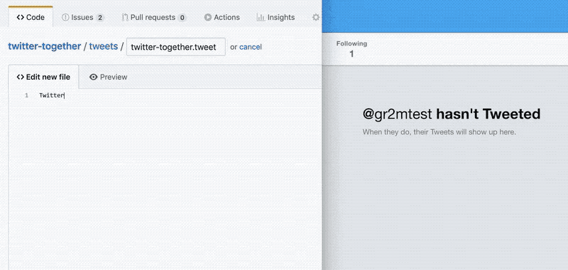

<p align="center">
  <a href="https://github.com/gr2m/twitter-together/issues/16"></a>
</p>

<h1 align="center">Twitter, together!</h1>

<p align="center">
  <a href="https://action-badges.now.sh" rel="nofollow"></a>
  <a href="https://github.com/gr2m/twitter-together/blob/80c8aab34382347120e22501c2e44f30a7a62174/package.json#L8" rel="nofollow"></a>
</p>

For Open Source or event maintainers that share a project twitter account, `twitter-together` is a GitHub Action that utilizes text files to publish tweets from a GitHub repository. Rather than tweeting directly, GitHub’s pull request review process encourages more collaboration, Twitter activity and editorial contributions by enabling everyone to submit tweet drafts to a project.

<p align="center">
  
</p>

<!-- toc -->

- [Try it](#try-it)
- [Twitter API compatibility](#twitter-api-compatibility)
- [Setup](#setup)
- [Contribute](#contribute)
- [How it works](#how-it-works)
  - [The `push` event](#the-push-event)
  - [The `pull_request` event](#the-pull_request-event)
- [Motivation](#motivation)
- [License](#license)

<!-- tocstop -->

## Try it

You can submit a tweet to this repository to see the magic happen. Please follow the instructions at [tweets/README.md](tweets/README.md) and mention your own twitter username to the tweet. This repository is setup to tweet from [https://twitter.com/commit2tweet](https://twitter.com/commit2tweet).

## Twitter API compatibility

The Twitter Ads API we currently use is the `v8` version.

## Setup

1. [Create a twitter app](docs/01-create-twitter-app.md) with your shared twitter account and store the credentials as `TWITTER_API_KEY`, `TWITTER_API_SECRET_KEY`, `TWITTER_ACCESS_TOKEN` and `TWITTER_ACCESS_TOKEN_SECRET` in your repository’s secrets settings.
2. [Create a `.github/workflows/twitter-together.yml` file](docs/02-create-twitter-together-workflow.md) with the content below. Make sure to replace `'main'` if you changed your repository's default branch.

   ```yml
   on: [push, pull_request]
   name: Twitter, together!
   jobs:
     preview:
       name: Preview
       runs-on: ubuntu-latest
       if: github.event_name == 'pull_request'
       steps:
         - uses: gr2m/twitter-together@v1.x
           env:
             GITHUB_TOKEN: ${{ secrets.GITHUB_TOKEN }}
     tweet:
       name: Tweet
       runs-on: ubuntu-latest
       if: github.event_name == 'push' && github.ref == 'refs/heads/main'
       steps:
         - name: checkout main
           uses: actions/checkout@v2
         - name: Tweet
           uses: gr2m/twitter-together@v1.x
           env:
             GITHUB_TOKEN: ${{ secrets.GITHUB_TOKEN }}
             TWITTER_ACCESS_TOKEN: ${{ secrets.TWITTER_ACCESS_TOKEN }}
             TWITTER_ACCESS_TOKEN_SECRET: ${{ secrets.TWITTER_ACCESS_TOKEN_SECRET }}
             TWITTER_API_KEY: ${{ secrets.TWITTER_API_KEY }}
             TWITTER_API_SECRET_KEY: ${{ secrets.TWITTER_API_SECRET_KEY }}
   ```

3. After creating or updating `.github/workflows/twitter-together.yml` in your repository’s default branch, a pull request will be created with further instructions.

Happy collaborative tweeting!

## Contribute

All contributions welcome!

Especially if you try `twitter-together` for the first time, I’d love to hear if you ran into any trouble. I greatly appreciate any documentation improvements to make things more clear, I am not a native English speaker myself.

See [CONTRIBUTING.md](CONTRIBUTING.md) for more information on how to contribute. You can also [just say thanks](https://github.com/gr2m/twitter-together/issues/new?labels=feature&template=04_thanks.md) 😊

## Thanks to all contributors 💐

Thanks goes to these wonderful people ([emoji key](https://allcontributors.org/docs/en/emoji-key)):

<!-- ALL-CONTRIBUTORS-LIST:START - Do not remove or modify this section -->
<!-- prettier-ignore -->
<table><tr><td align="center"><a href="https://jasonet.co"><br /><sub><b>Jason Etcovitch</b></sub></a><br /><a href="#design-JasonEtco" title="Design">🎨</a> <a href="https://github.com/gr2m/twitter-together/commits?author=JasonEtco" title="Documentation">📖</a> <a href="https://github.com/gr2m/twitter-together/commits?author=JasonEtco" title="Code">💻</a></td><td align="center"><a href="http://erons.me"><br /><sub><b>Erons</b></sub></a><br /><a href="https://github.com/gr2m/twitter-together/commits?author=Eronmmer" title="Documentation">📖</a></td></tr></table>

<!-- ALL-CONTRIBUTORS-LIST:END -->

This project follows the [all-contributors](https://github.com/all-contributors/all-contributors) specification. Contributions of any kind welcome!

## How it works

`twitter-together` is using two workflows

1. `push` event to publish new tweets
2. `pull_request` event to validate and preview new tweets

### The `push` event

When triggered by the `push` event, the script looks for added `*.tweet` files in the `tweets/` folder or subfolders. If there are any, a tweet for each added tweet file is published.

If there is no `tweets/` subfolder, the script opens a pull request creating the folder with further instructions.

### The `pull_request` event

For the `pull_request` event, the script handles only `opened` and `synchronize` actions. It looks for new `*.tweet` files in the `tweets/` folder or subfolders. If there are any, the length of each tweet is validated. If one is too long, a failed check run with an explanation is created. If all tweets are valid, a check run with a preview of all tweets is created.

## Motivation

I think we can make Open Source more inclusive to people with more diverse interests by making it easier to contribute other things than code and documentation. I see a particularly big opportunity to be more welcoming towards editorial contributions by creating tools using GitHub’s Actions, Apps and custom user interfaces backed by GitHub’s REST & GraphQL APIs.

I’ve plenty more ideas that I’d like to build out. Please ping me on twitter if you’d like to chat: [@gr2m](https://twitter.com/gr2m).

## License

[MIT](LICENSE)
