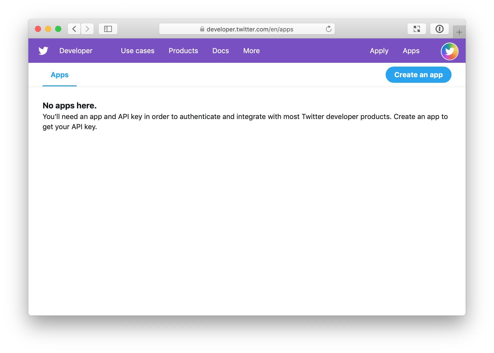
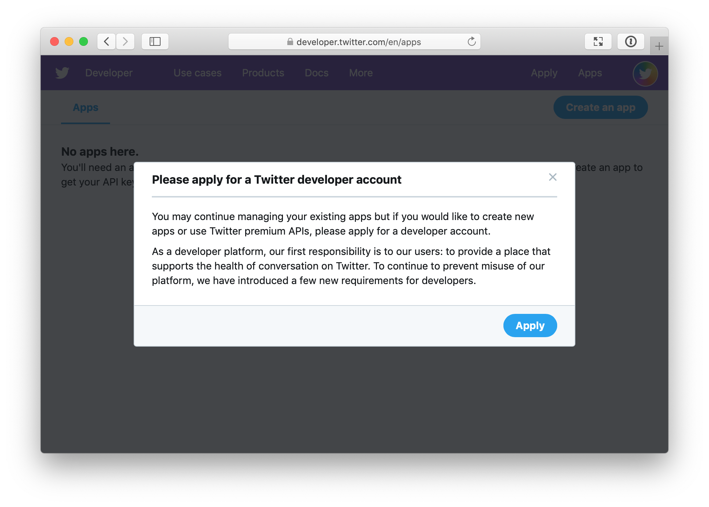
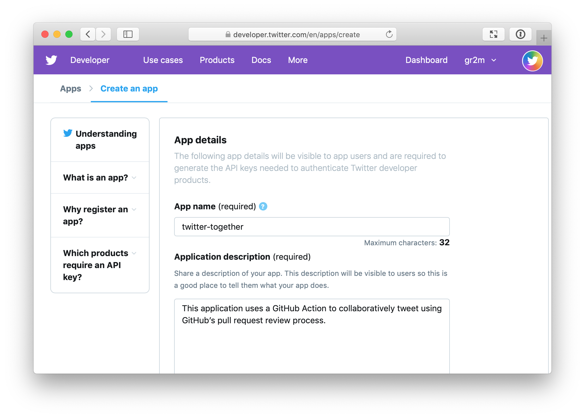
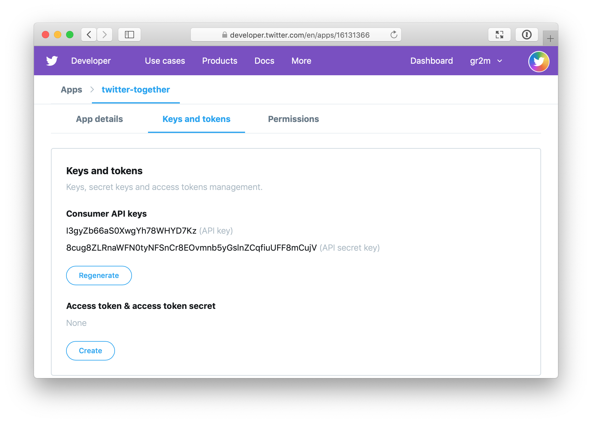
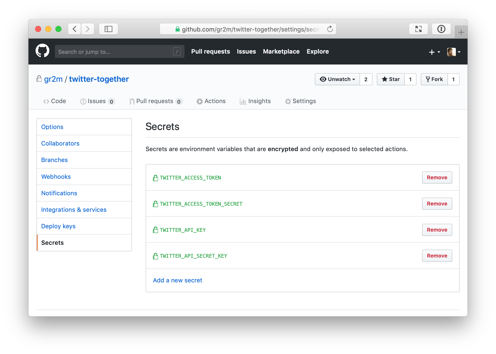

[back to README.md](../README.md/#setup)

# Create a twitter app

You can create a twitter app for your twitter account at https://developer.twitter.com/en/apps.

If you haven’t yet, you will be asked to apply for a Twitter developer account. See my answers below for reference. If you’ve done that before, skip the next section and continue at [Create an app](#create-an-app).

## Apply for a developer account

You might be asked to add a phone number to your twitter account before proceeding. If the phone number is used in another account, it won’t let you use it again. But you can remove the phone number from the other account. You can change it back once your developer account was approved.

Your twitter account will also need to be associated with an email address. If it isn't yet, set the email address in your twitter account [email settings](https://twitter.com/settings/email).

### Who are you requesting access for?

    ( ) I am requesting access for my organization
    (x) I am requesting access for my own personal use

### Account name

The twitter account name of your project

### Primary country of operation

When in doubt, select United States

### What use case(s) are you interested in?

    [ ] Academic research
    [ ] Advertising
    [ ] Audience analysis
    [ ] Chatbots and automation
    [ ] Consumer / end-user experience
    [ ] Engagement and customer service
    [x] Publish and curate Tweets
    [ ] Student project / Learning to code
    [ ] Topic analysis
    [ ] Trend and event detection
    [ ] Other

### Describe in your own words what you are building

#### 1. What is the core use case, intent, or purpose for your use of Twitter's APIs?

This app will be used to publish tweets using the [twitter-together](https://github.com/gr2m/twitter-together/) GitHub Action. It allows to use a GitHub repository and pull request reviews as a workflow to collaboratively tweet from a shared twitter account.

#### 2. Do you intend to analyze Tweets, Twitter users, or their content? If so, share details about the analyses you plan to conduct and the methods or techniques you plan to use.

No

#### 3. Does your use case involve Tweeting, Retweeting, or liking content? If so, share how you will interact with Twitter users or their content.

Yes. This app will be used to publish tweets for this account. It might be used for retweeting in future. There are no plans for liking.

#### 4. How will Twitter data be displayed to users of your solution? If you plan to display Twitter content off of Twitter, explain how and where Tweets and Twitter content will be displayed to users of your product or service. Will individual Tweets and Twitter content be displayed, or will information about Tweets or Twitter content be displayed in aggregate?

No twitter data will be displayed. The `twitter-together` GitHub action shows a preview of the tweet before it is published and becomes twitter data.

### Will your product, service, or analysis make Twitter content or derived information available to a government entity?

No

---

You will receive an email to verify your developer account. After that you can create an app at https://developer.twitter.com/en/apps/create.

## Create an app

Only 4 questions are required. Here are my answers for reference

### App name (required)

`<your twitter account name>-twitter-together`, e.g. `probot-twitter-together`

### Application description (required)

Collaboratively tweet using GitHub’s pull request review process by utilizing the twitter-together GitHub Action.

### Website URL (required)

https://github.com/gr2m/twitter-together

### Tell us how this app will be used (required)

This app will be used to create tweets that have previously been reviewed and accepted on our GitHub repository. It allows everyone to submit a tweet draft that we can discuss prior publishing.

### Set app permissions

When you have created your app, open `app settings` and set app permissions to "Read & Write".

## Save credentials

"read and write" permissions are required. If you change the permission you must re-generate tokens for the change to take effect

Open your app’s "Keys and tokens" tab. In the "Access token & access token secret" section, press the "Create" button. After that you will see all four credentials required for `twitter-together`

Now save the credentials into your repository’s "Secrets" settings as follows

| Twitter Credential name | GitHub Secret name            |
| ----------------------- | ----------------------------- |
| API key                 | `TWITTER_API_KEY`             |
| API secret key          | `TWITTER_API_SECRET_KEY`      |
| Access token            | `TWITTER_ACCESS_TOKEN`        |
| Access token secret     | `TWITTER_ACCESS_TOKEN_SECRET` |

---

next: [Create a `.github/workflows/twitter-together.yml` file](02-create-twitter-together-workflow.md)
