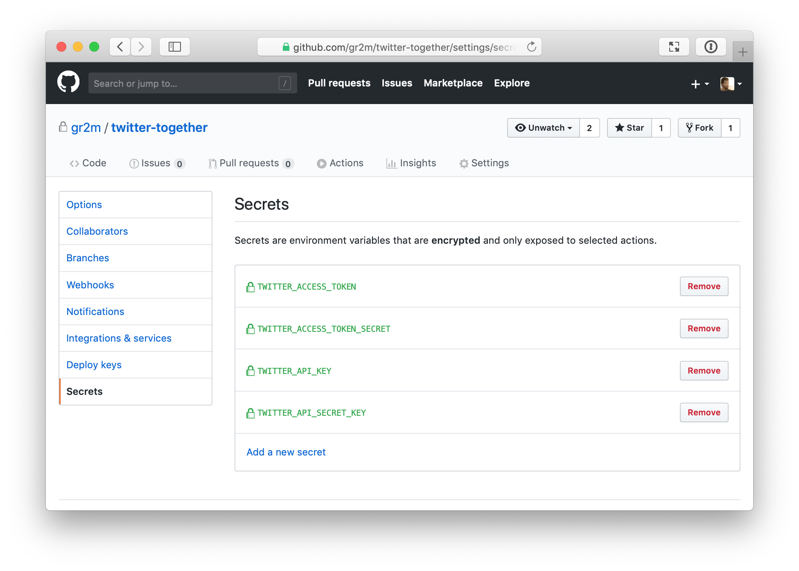

[back to README.md](../README.md/#setup)

# Create a Twitter App

Head to <https://developer.twitter.com/en/portal/projects-and-apps> to begin the process of creating a Twitter app.

If you haven’t yet, you will be asked to apply for a Twitter developer account.
If you’ve done that before, skip the next section and continue at [Create an app](#create-an-app).

## Apply for a developer account

You might be asked to add a phone number to your Twitter account before proceeding.
If the phone number is used in another account, it won’t let you use it again
But you can remove the phone number from the other account.
You can change it back once your developer account was approved.

Your Twitter account will also need to be associated with an email address.
If it isn't yet, set the email address in your Twitter account [email settings](https://twitter.com/settings/email).

During the account creation, Twitter tends to ask about what you'll be doing with the developer account.
If you aren't sure what to answer, here are our recommend answers:

- What's your use case? Select "Making a bot".
- Will you make Twitter content or derived information available to a government entity or a government affiliated entity? Select "No".

Once you've submitted the form, you will receive an email to verify your developer account.
After that you can head back to <https://developer.twitter.com/en/portal/projects-and-apps> to begin creating your app.

---

## Create an App

### Project creation

Before we create the app itself, we need to create a project that will house the app.
If you've already got a project in your developer account that you want to use, skip this step.
Head to <https://developer.twitter.com/en/portal/projects/new> or click "Create Project" on your dashboard.

#### Project name

You can provide any name you want for your project here.
We recommend keeping the name related to Twitter, Together, to avoid future confusion.

#### Project use case

If unsure, select "Making a bot" for the project use case.

#### Project description

You can provide any description you want for your project here.
If you're creating this project for Twitter, Together only, you could use:

> Collaboratively tweet using GitHub’s pull request review process by utilizing the twitter-together GitHub Action.

### App creation

With the project created, we can now create the app itself.
If you've gone through the project creation flow immediately before, Twitter may automatically take you to the app creation flow.
If not, head back to your [dashboard](https://developer.twitter.com/en/portal/projects-and-apps) and look for a "Add App" button under your project.

#### App environment

Depending on your level of access to the Twitter API, the app creation flow may or may not ask you for this step.

If you are asked for the app environment, select the environment the best suites how you'll be using Twitter, Together.

#### App name

Twitter app names are globally unique, so you'll want to provide a name here that makes sense in the context of your Twitter account or intended usage.
We recommend going for `<your twitter account name>-twitter-together`, e.g. `probot-twitter-together`.

Once you've provided the app name, Twitter will present you with credentials for your app.
Note down the "API Key" and "API Secret" as we'll need them later.

#### App settings

With your app created, head to the settings for the app as we'll need to ensure it has write access as well as the default read access.
Twitter seems to change this UI far too often, but as of writing, to enable write access you'll need to configure "User authentication settings".

Press "Set up" under the "User authentication settings" section. Select "Read and write" under "App permissions" and "Web App, Automated App or Bot" under "Type of App".

Now we'll need to configure a fake OAuth 2.0 flow (which we won't use):

- App info -> Callback URI: http://localhost
- App info -> Website URL: https://github.com/twitter-together/action

With those all set, press "Save" and confirm that you are happy to change the permissions for your app.
Disregard the client ID and secret presented, as we won't actually be using OAuth.

### Save credentials

Head back to your app settings, and jump into the "Keys and tokens" tab.

If you forgot to note down the API Key/Secret earlier, no worries!
Press "Regenerate" next to "API Key and Secret" and Twitter will give you a new pair.

We'll also want to press "Regenerate" next to the "Access Token and Secret" as we need to update the permissions it has to be both read and write.
Note down the token and token secret Twitter gives you.

Now save the credentials into your repository’s "Secrets" settings as follows:

| Twitter Credential name | GitHub Secret name            |
| ----------------------- | ----------------------------- |
| API key                 | `TWITTER_API_KEY`             |
| API secret key          | `TWITTER_API_SECRET_KEY`      |
| Access token            | `TWITTER_ACCESS_TOKEN`        |
| Access token secret     | `TWITTER_ACCESS_TOKEN_SECRET` |

---

You're all set! :tada:

Next: [Create a `.github/workflows/twitter-together.yml` file](02-create-twitter-together-workflow.md)
