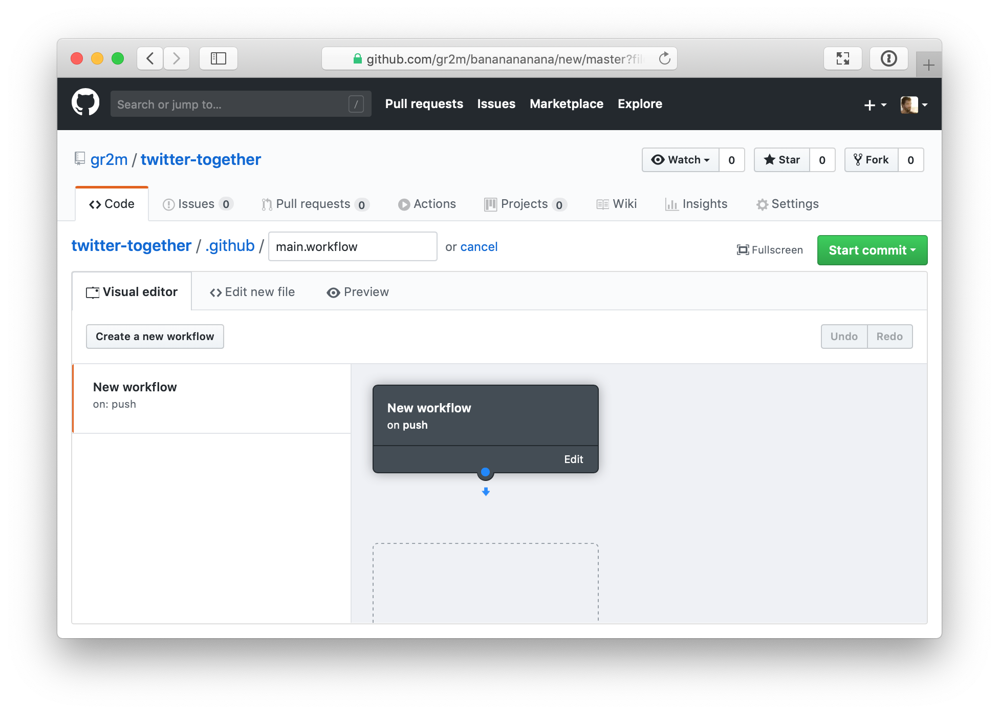
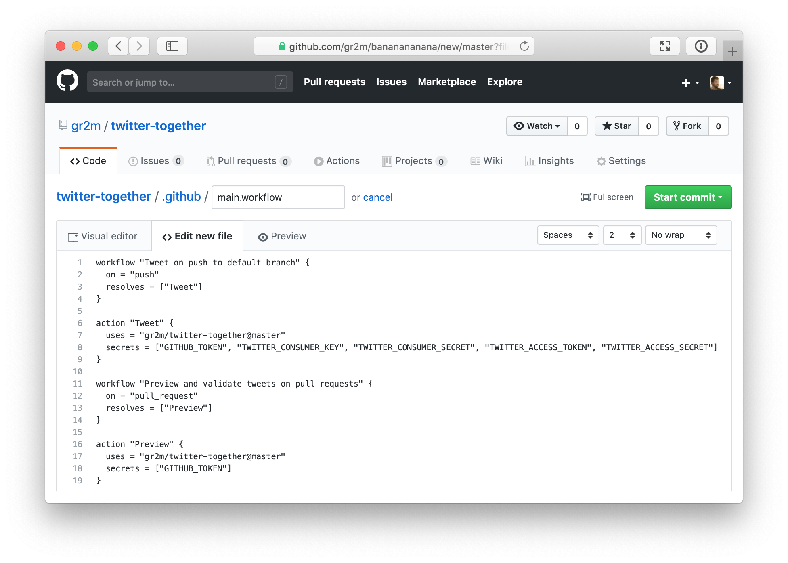

[back to README.md](../#setup)

# Create a `.github/main.workflow` file

In your repository, open the Actions tab.


Press the <kbd>create a new workflow</kbd> button to open the visual workflow editor. If you don’t see the button, look for the "main.workflow" link.



When you see the visual editor, press the `<> Edit new file` tab. This will open the code editor into which you can paste the content below

```workflow
workflow "Tweet on push to default branch" {
  on = "push"
  resolves = ["Tweet"]
}
 
action "Tweet" {
  uses = "gr2m/twitter-together@master"
  secrets = ["GITHUB_TOKEN", "TWITTER_API_KEY", "TWITTER_API_SECRET_KEY", "TWITTER_ACCESS_TOKEN",  "TWITTER_ACCESS_TOKEN_SECRET"]
}
 
# "push" event won’t work on forks, hence the 2nd workflow with "pull_request"
workflow "Preview and validate tweets on pull requests" {
  on = "pull_request"
  resolves = ["Preview"]
}
 
action "Preview" {
  uses = "gr2m/twitter-together@master"
  secrets = ["GITHUB_TOKEN"]
}
```



---

Nearly done! Shortly after creating or updating `.github/main.workflow` in your repository’s default branch, a pull request will be created with further instructions.

[back to README.md](../#setup)
