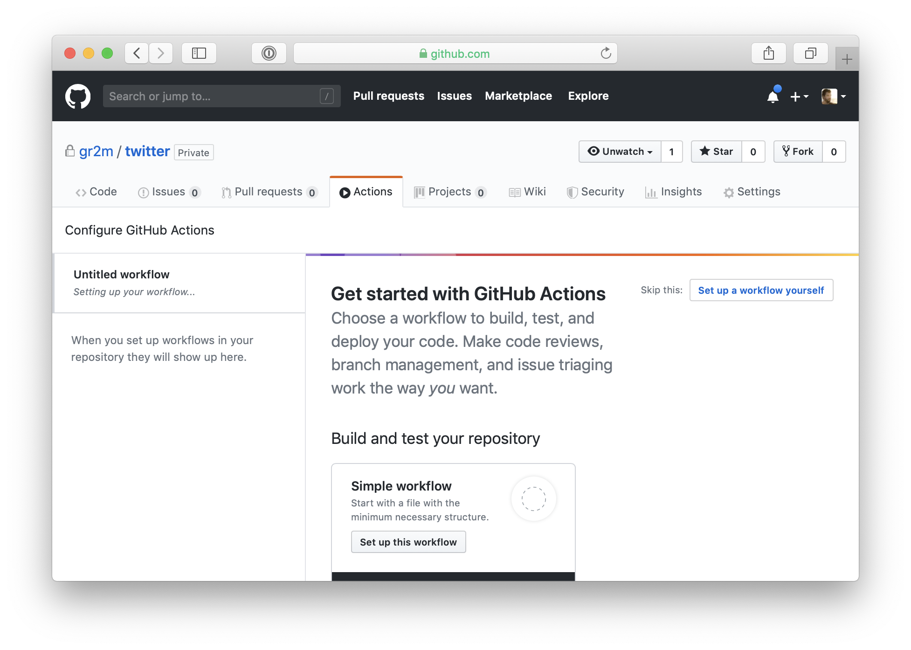

[back to README.md](../README.md/#setup)

# Create a `.github/workflows/twitter-together.yml` file

In your repository, open the Actions tab.



Press the <kbd>Setup a new workflow yourself</kbd> button to open the file editor.


In the filename input above the code area, replace `main.yml` with `twitter-together.yml`. Then replace the code:

```yml
on: [push, pull_request]
name: Twitter, together!
jobs:
  preview:
    name: Preview
    runs-on: ubuntu-latest
    if: github.event_name == 'pull_request'
    steps:
      - uses: gr2m/twitter-together@v1.x
        env:
          GITHUB_TOKEN: ${{ secrets.GITHUB_TOKEN }}
  tweet:
    name: Tweet
    runs-on: ubuntu-latest
    if: github.event_name == 'push' && github.ref == 'refs/heads/main'
    steps:
      - name: checkout main
        uses: actions/checkout@v2
      - name: Tweet
        uses: gr2m/twitter-together@v1.x
        env:
          GITHUB_TOKEN: ${{ secrets.GITHUB_TOKEN }}
          TWITTER_ACCESS_TOKEN: ${{ secrets.TWITTER_ACCESS_TOKEN }}
          TWITTER_ACCESS_TOKEN_SECRET: ${{ secrets.TWITTER_ACCESS_TOKEN_SECRET }}
          TWITTER_API_KEY: ${{ secrets.TWITTER_API_KEY }}
          TWITTER_API_SECRET_KEY: ${{ secrets.TWITTER_API_SECRET_KEY }}
```

Make sure to replace `'main'` if you changed your repository's default branch.


To create the file, press the <kbd>Start commit</kbd> button. You can optionally set a custom commit message, then press <kbd>Commit new file</kbd>.

---

Nearly done! Shortly after creating or updating `.github/workflows/twitter-together.yml` in your repository’s default branch, a pull request will be created with further instructions.

If you like to create tweets including polls, you will have to [apply for access to the Twitter Ads API](03-apply-for-access-to-the-twitter-ads-api.md).

[back to README.md](../README.md/#setup)
